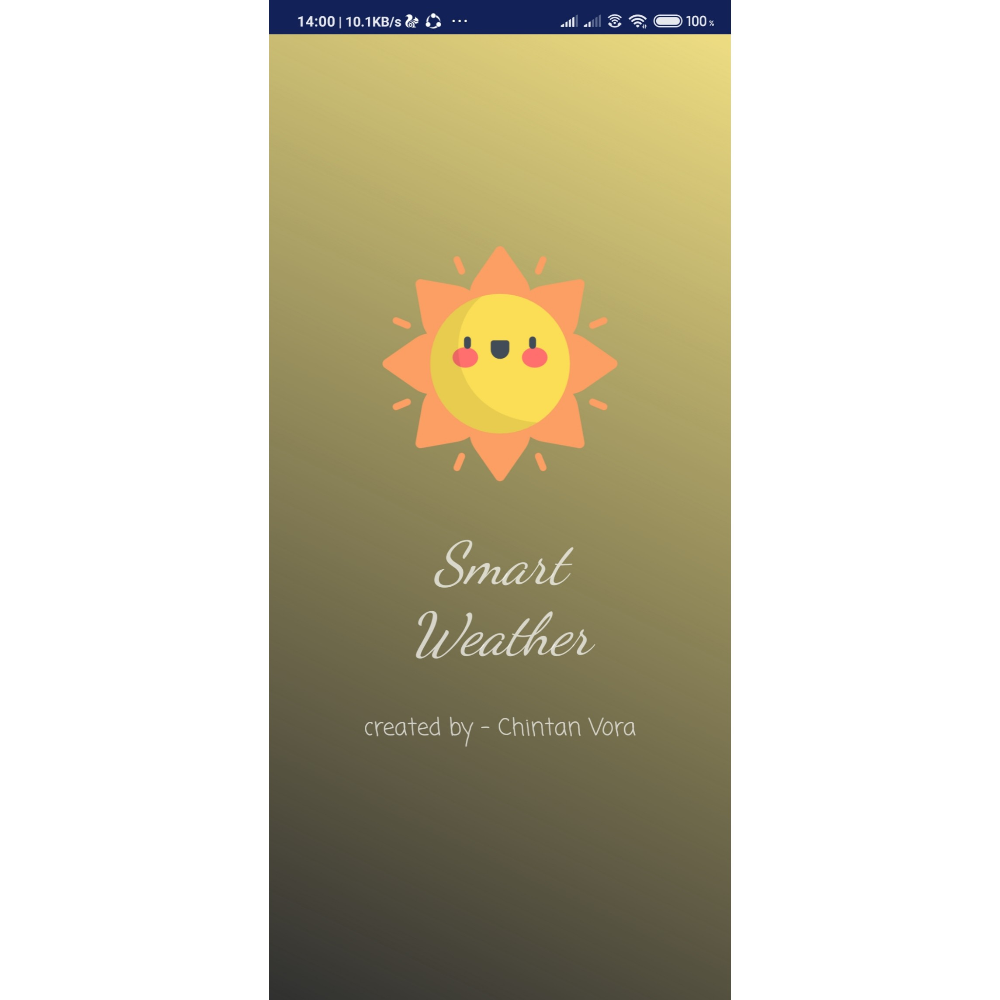
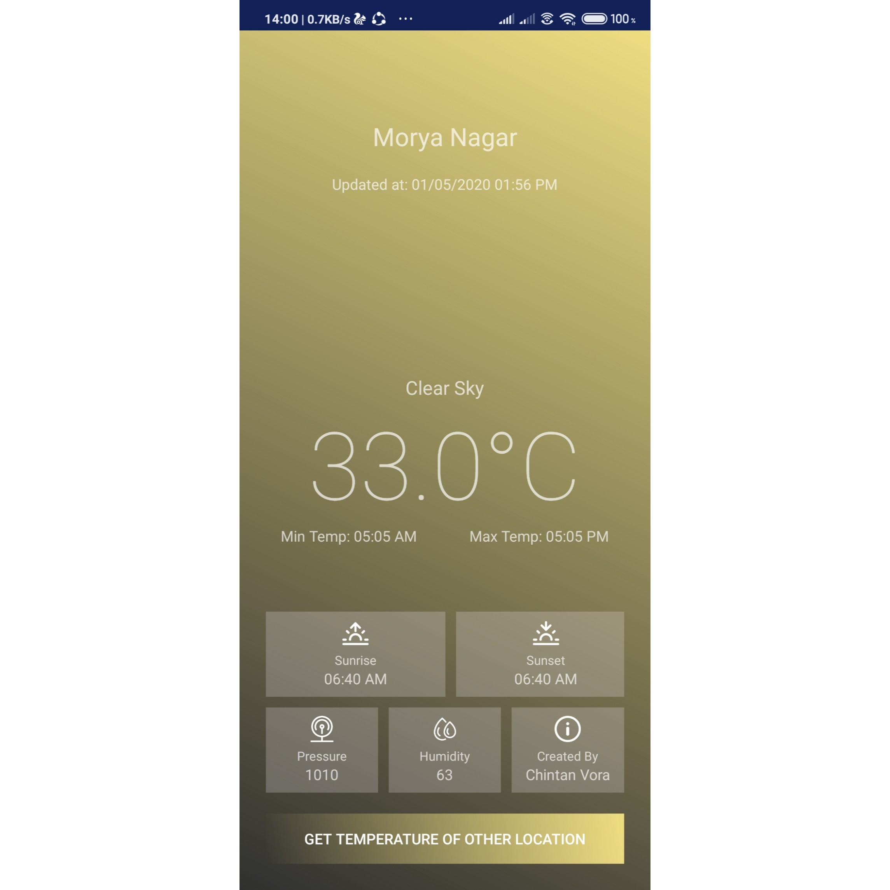
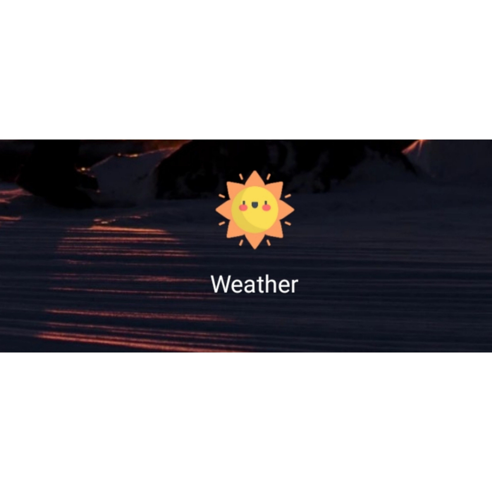

# My-Weather-App
#trail111

This is a Smart Weather Application which displays basic weather information depending on the location of the  User. It also allows us to find the weather details of a particular city by using openweathermap API.

The Weather information exactly contains City/Area name, Temperature (in degrees), Pressure, Humidity, etc. This application supports only Android devices as it is built with Java as a Backend language and XML as a front end language.

## The flow of the Application is as follows :

1] Application starts with a splash screen displaying the application name with an animation.

    

2] Then the next screen is the main screen where a user can get to know about the temperature of his/her current location, For Eg. His location is XYZ area, so the application detects the location and fetches the information through API and returns the response in JSON Format. We need to provide the access to location on our mobile manually.

  

3] If you want to know the weather details of any location then click on the button at the bottom of the screen and you will be redirected to next screen where you can enter the name of the City of which you want the weather information respectively.

  

4] After entering the city name for eg "DELHI", you might get the following results:

  

5] You can quit the application as I have added an alert if you aren't sure to quit the application

  

I have also added an icon to the application as follows:

  
